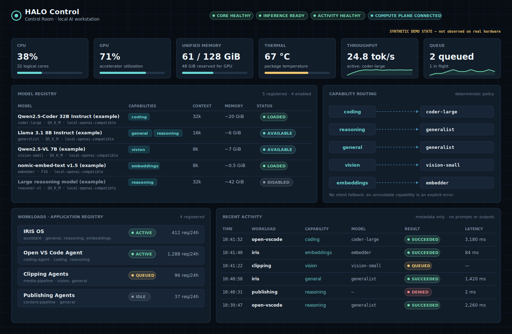
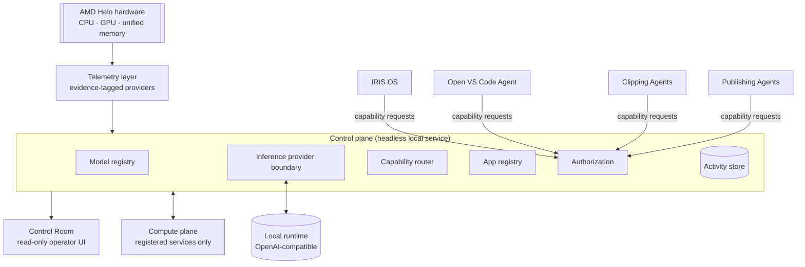

<div align="center">

# HALO Control

**The local control plane for an AMD Halo AI workstation.**

It tracks the hardware, the models, which workload may use which capability, how requests are routed to local inference, and what actually ran, all on one machine with no cloud dependency.

   



<sub>Control Room, recreated for this public edition with fully synthetic state and the project's real design tokens. No real machine, network or workload data is shown.</sub>

</div>

---

> **Public edition.** This repository is the public architecture and engineering edition of a private local-infrastructure project. It contains design documentation, illustrative contracts, a small illustrative routing function and synthetic data. It does **not** contain the production implementation, configuration or any infrastructure details. [Scope](#public-repository-scope).

## Architecture



→ [docs/architecture.md](docs/architecture.md)

## Why HALO exists

Several local AI workloads share one machine: a personal AI operating system, a coding agent, media and publishing pipelines. Without a control plane, each one configures its own model endpoint, keeps its own logs, and competes for the same unified memory blindly. HALO centralizes the shared decisions (which models exist, who may use them for what, where requests go, what ran, whether the machine is healthy) and leaves each workload's logic to the workload.

It is infrastructure. It is not a chatbot or an agent, and it doesn't do any reasoning of its own.

## Major subsystems

| Subsystem | Responsibility |
| --- | --- |
| **Telemetry** | Machine health with an explicit evidence class per signal |
| **Model registry** | Versioned inventory of models, capabilities, context sizes and resource needs |
| **Inference boundary** | Provider-neutral local inference (disabled / mock / OpenAI-compatible HTTP) |
| **Capability router** | Capability → model, deterministic, declared policy, no silent fallback |
| **Application registry + authorization** | Per-workload identity and capability allowlists |
| **Activity store** | Local SQLite history of what ran; metadata only |
| **Compute plane** | Starts and stops pre-registered local services; reports observed state |
| **Control Room** | Read-only operator UI that validates every response it renders |

## Local inference

Workloads never call a model runtime directly. HALO resolves the capability to a registered model, checks that the model is enabled and capable, and calls the runtime through an OpenAI-compatible HTTP boundary with a timeout. The endpoints and internal model references stay server-side. Inference is **off by default** and has to be enabled explicitly. → [docs/local-first-design.md](docs/local-first-design.md)

## Model registry

Each model record holds its family, size, quantization, context window, capabilities, input modalities, approximate memory and provider. **Registration is not availability**: the registry says what HALO knows about, and the provider says what is actually loadable or loaded. → [docs/model-registry.md](docs/model-registry.md)

## Capability routing

```
Task → required capability → declared candidates → eligibility + resource checks → selected model & runtime
```

Today routing is deterministic and driven by versioned policy that is cross-checked against the registry at startup. An unroutable request is an explicit error. Resource-aware selection is the next step, and it is shown by a small illustrative router you can run:

```bash
node --experimental-strip-types examples/route-demo.ts
```

→ [docs/capability-routing.md](docs/capability-routing.md)

## Telemetry

CPU, GPU, unified memory (including the GPU-reserved share), temperature, active model, throughput and queue depth. Every signal carries an evidence class (`mocked`, `local-real`, `halo-real` or `unavailable`), so the Control Room never shows a guess as a measurement. → [docs/telemetry.md](docs/telemetry.md)

## Workloads

IRIS OS, Open VS Code Agent, Clipping Agents and Publishing Agents are registered as **abstract consumers**. Each has an id, an enabled flag and a capability allowlist, and the pipeline is authenticate → authorize → route → infer → record. → [docs/workload-management.md](docs/workload-management.md)

## Security model

- Local-only by design.
- Per-workload credentials, and authorization before any routing or inference.
- The compute plane accepts operations on registered service ids only: no commands, no shell.
- Activity history stores metadata only.
- Telemetry excludes all identifiers.
- Media URLs are denied by default.

→ [docs/security-model.md](docs/security-model.md) · [SECURITY.md](SECURITY.md)

## Example synthetic state

| File | Contents |
| --- | --- |
| [`synthetic-telemetry.json`](examples/synthetic-telemetry.json) | A machine snapshot with utilization series |
| [`synthetic-models.json`](examples/synthetic-models.json) | Five example models across all capabilities |
| [`synthetic-workloads.json`](examples/synthetic-workloads.json) | Four workloads with capability grants |
| [`synthetic-activity.json`](examples/synthetic-activity.json) | Recent activity, including a denied request |

The Control Room image above is rendered from exactly these files.

## Current development status

| Area | Status | Evidence |
| --- | --- | --- |
| Headless control plane, contracts, health/version/system APIs | Implemented | Local-real |
| Model registry + inspection | Implemented (development example entries) | Local-real |
| Deterministic capability routing | Implemented | Local-real |
| Application identity + capability authorization | Implemented | Local-real |
| SQLite activity history | Implemented | Local-real |
| Control Room (read-only) | Implemented | Local-real UI |
| Compute plane daemon + registered managed services | Implemented | Local-real |
| Real workload requests reaching HALO (assistant, publishing, clipping) | Demonstrated | Application-real |
| Real model runtime answering through HALO | **Not yet verified** | — |
| Running on the AMD Halo target hardware | **Not yet verified**: hardware bring-up pending | — |
| Resource-aware routing | Design goal | Illustrative code only |

## Public repository scope

This is a public architecture and engineering edition of a private local-infrastructure project, and **the complete production implementation is not included**.

**Included:** design documentation written for this edition, illustrative TypeScript contracts, one illustrative routing function with a runnable demo, synthetic example data, and a Control Room recreation rendered from that data.

**Intentionally not included:** source code, configuration files, environment variables, ports, socket and filesystem paths, credentials and credential formats, network or machine details, bootstrap and hardware-detection scripts, exact authorization rules, the private routing policy, and real activity or telemetry.

This repository has its own history. It was not forked, mirrored or filtered from the private one.

---

<sub>© Raul Mermans · docs CC BY 4.0, code MIT (see [LICENSE](LICENSE)) · [SECURITY.md](SECURITY.md)</sub>
