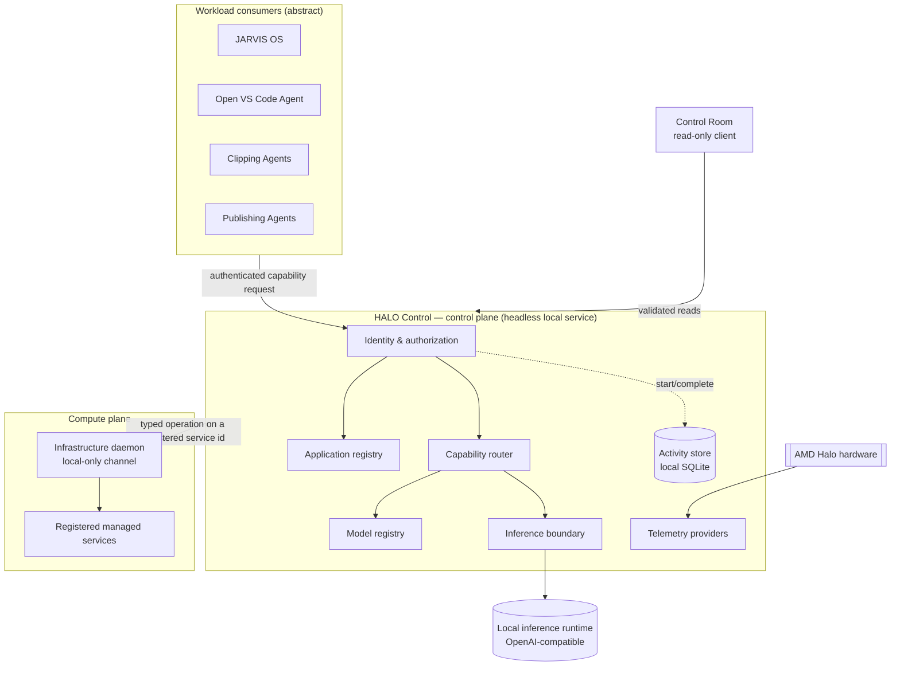

# Architecture

> Public edition: responsibilities and boundaries, not implementation.

## Planes and authorities

| Concern | Authority |
| --- | --- |
| Which applications exist and what they may request | Control plane (application registry) |
| Which models exist and what they can do | Control plane (model registry) |
| Which model serves a capability | Control plane (routing policy) |
| What actually ran, and how it ended | Activity store |
| Actual service/process state | Compute plane (reports it; control never invents it) |
| Hardware facts | Telemetry provider, tagged with evidence class |

**Control says what should happen, the compute plane executes only pre-registered operations, and the compute plane reports what actually happened.**

## Request lifecycle

1. A workload sends a capability request (for example `coding`) with its local credential.
2. **Authenticate, then authorize:** is the workload known, enabled, and granted this capability? If not, it is denied before anything else runs.
3. An activity record is opened (`running`).
4. **Route:** capability → registered, enabled, capable model (see [capability-routing.md](capability-routing.md)).
5. **Infer** through the provider boundary, with a timeout. Provider endpoints and model references never leave the server side.
6. The activity record is completed once, with a typed outcome and latency. Content is never stored.

## Design properties

- **Headless core.** The UI is a client. Closing the Control Room or a desktop shell doesn't stop HALO.
- **Contracts at every boundary.** Every response is validated at runtime, including in the browser before it is rendered.
- **Mock and live evidence are kept apart.** Every observation carries an evidence class (see [telemetry.md](telemetry.md)).
- **Fail closed and fail visible.** Disabled inference, an unreachable compute plane or degraded history show up as explicit statuses, never as fabricated values.
- **Failure isolation.** If the compute plane is down, the control plane keeps serving unrelated APIs.
