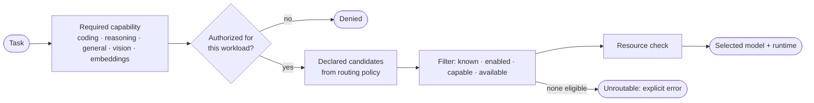

# Capability routing

Workloads ask for a **capability**, not a model. That keeps IRIS, the coding agent and the media pipelines independent of which model is installed this month.



## Current behaviour (implemented)

- **Deterministic.** The same capability and the same policy give the same model, every time.
- **Declared policy only.** Routing policy is versioned configuration, validated against the model registry at startup.
- **No silent fallback.** If the declared route can't be served, the request fails with an explicit, typed reason.
- **The router returns a model id, nothing more.** Provider selection and invocation happen behind the inference boundary.
- **Inspectable.** A read-only Route Inspector shows, for each capability, which model would be chosen and why.

## Direction (design goal, not yet implemented)

Resource-aware selection: preferring models that are already resident, and skipping candidates that don't fit current memory. [`interfaces/capability.ts`](../interfaces/capability.ts) contains a small **illustrative** router written for this public edition to show the idea:

```
for each declared candidate, in order:
  skip if unknown, disabled, lacking the capability, or unavailable
  skip if not resident and its memory footprint exceeds free memory
  otherwise select it
if none selected: unroutable (never pick an undeclared model)
```

You can run it on the synthetic data:

```bash
node --experimental-strip-types examples/route-demo.ts
```

```
coding      → coder-large  (resident)
reasoning   → generalist  (fits)  skipped: reasoner-xl:disabled
general     → generalist  (fits)
vision      → vision-small  (fits)
embeddings  → embedder  (resident)
```

The private routing policy, including real model assignments, isn't published.
