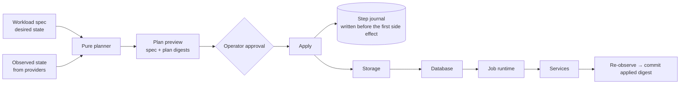

# Operations and recovery

> Public edition. Behaviour and guarantees only; schemas, paths and configuration are private.

Beyond starting services, a workload needs storage, possibly a database, a job queue, and a way back when something breaks. These pieces compose under one rule: **the control plane owns desired state and approval, the compute plane owns execution and observed state.**

## Workload reconciliation

- **One-shot and explicit.** There is no background controller. An operator previews a plan and approves it; the planner can't execute anything.
- **Digests guard drift.** Immediately before applying, the daemon re-validates the spec and re-plans. If either digest changed, or a required resource is unsupported or `unknown`, nothing is mutated.
- **Journal first.** The full ordered step list is written before the first side effect and checkpointed after each step. The applied digest is committed only after verified convergence.
- **No hidden rollback or retry.** Earlier successful steps stay; the next explicit reconciliation observes everything again and treats satisfied resources as no-ops.
- **Fixed resource graph**, not a generic DAG: storage → database → job runtime → services, with service dependencies ordering the last phase.

## Durable jobs

A code-owned job-type registry (type, schema version, input/output schemas, permission class, retry policy) and a durable SQLite queue. A separate worker process claims one job at a time under a lease; an expired lease is recovered by a later claim. Explicit idempotency keys reject conflicting reuse. Retries are opt-in, bounded, and require idempotent semantics before any external side effect. Running jobs can't be cancelled (that would be misreported); queued jobs can. The production job-type registry is empty; fixtures prove the substrate.

## Storage and database

- **Storage:** governed directory allocations under logical names, with safe-path checks; no general filesystem API.
- **PostgreSQL:** a provisioning provider exists, with secrets resolved only inside the compute plane and passed to services as references. Real-server acceptance is **deferred to the hardware phase**; the tests use a fake server, and that is not counted as PostgreSQL evidence.

## Observability

Infrastructure emits bounded audit events (reconciliation, jobs, services, approvals, backups) correlated by operation id, plus a diagnostics read model the Control Room renders. Unknown values are shown as `unknown`, never as `ok`. Secrets never appear in returned data.

## Recovery points

- A recovery point is an immutable, digest-verified snapshot of the infrastructure state store and allocated files, created only when the system is quiescent (no active reconciliation, no queued or running jobs, no active services).
- `verify` independently rechecks the manifest, file inventory, hashes and SQLite integrity.
- **Staging restore** copies into a separate location and re-verifies it. It is evidence that a restore would work, not a restore.
- **Production restore is not enabled.** It is registered as a destructive action with no executor, route or button, and policy can't turn it on. PostgreSQL data, raw secrets and job payloads are reported as not covered.

## Failure injection and evaluation

Two evaluation suites cover infrastructure failure modes: daemon loss, worker crash, expired leases, interrupted reconciliation, corrupted recovery points, approval bypass attempts, stale approvals, policy changes between approval and execution, and more. At the frozen pre-Halo baseline:

| Suite | Result | Evidence class |
| --- | --- | --- |
| Deterministic and mocked-fault scenarios | 49/49 | `mocked` |
| Local real-fault scenarios (real processes, signals, SQLite, filesystem) | 9/9 | `local-real` |
| Full test suite | 478 passed, 1 skipped (real PostgreSQL test, no server available) | `local-real` |

Measured on a macOS development workstation, not on the target machine. Every governed action has an outcome-certainty rule for interruptions: if the durable records prove what happened, that outcome stands; otherwise it stays uncertain and needs a new proposal after inspection. Operator runbooks cover each failure mode.

## Pre-Halo baseline

The architecture was frozen as a pre-Halo baseline once all of the above was built and verified without the target machine. Frozen means new architecture needs a recorded decision and evidence; hardware-forced changes are expected and get recorded the same way. Hardware-dependent work (capacity management, systemd supervision, real PostgreSQL, model runtime) goes to a deferred ledger for the hardware phase.
